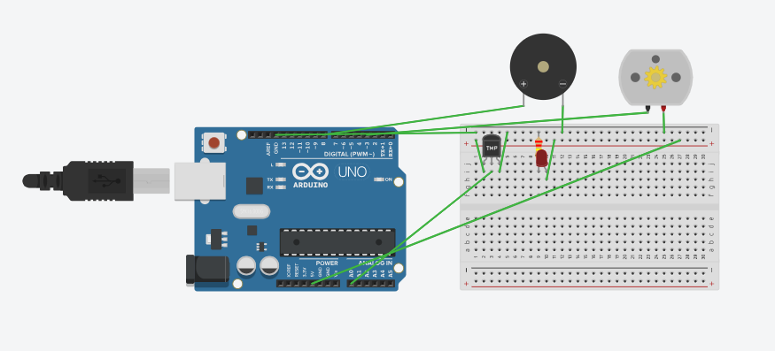

# 🌡️ Projeto de Circuitos Eletrônicos - IoT

Este projeto foi desenvolvido como parte de um desafio do curso de IoT da DIO, com o objetivo de simular uma **estufa de hortaliças** utilizando o simulador Tinkercad e a plataforma Arduino.

---

## 📌 Descrição do Projeto

O sistema consiste em um circuito eletrônico capaz de monitorar a temperatura ambiente e tomar decisões automáticas com base nos valores obtidos.

Foram utilizados os seguintes componentes:

- Sensor de temperatura (TMP36)
- LED vermelho
- Buzzer (buzina)
- Motor (simulando ventilador)
- Arduino

---

## ⚙️ Funcionalidades

O sistema implementa as seguintes regras:

- 🌡️ **Leitura da temperatura**
  - O sensor captura a temperatura ambiente continuamente

- 🌀 **Controle de ventilação**
  - Quando a temperatura for **igual ou maior que 30°C**, o motor é acionado

- 🚨 **Alerta de emergência**
  - Quando a temperatura ultrapassar **50°C**:
    - O LED vermelho é acionado
    - A buzina é ativada

---

## 🖼️ Circuito no Tinkercad

---

## 💻 Implementação

Todo o controle do sistema foi desenvolvido utilizando a linguagem C na plataforma Arduino.

O código realiza:

- Leitura do sensor analógico
- Conversão para temperatura em graus Celsius
- Estruturas condicionais para tomada de decisão
- Acionamento dos componentes com `digitalWrite`

Arquivo principal:
